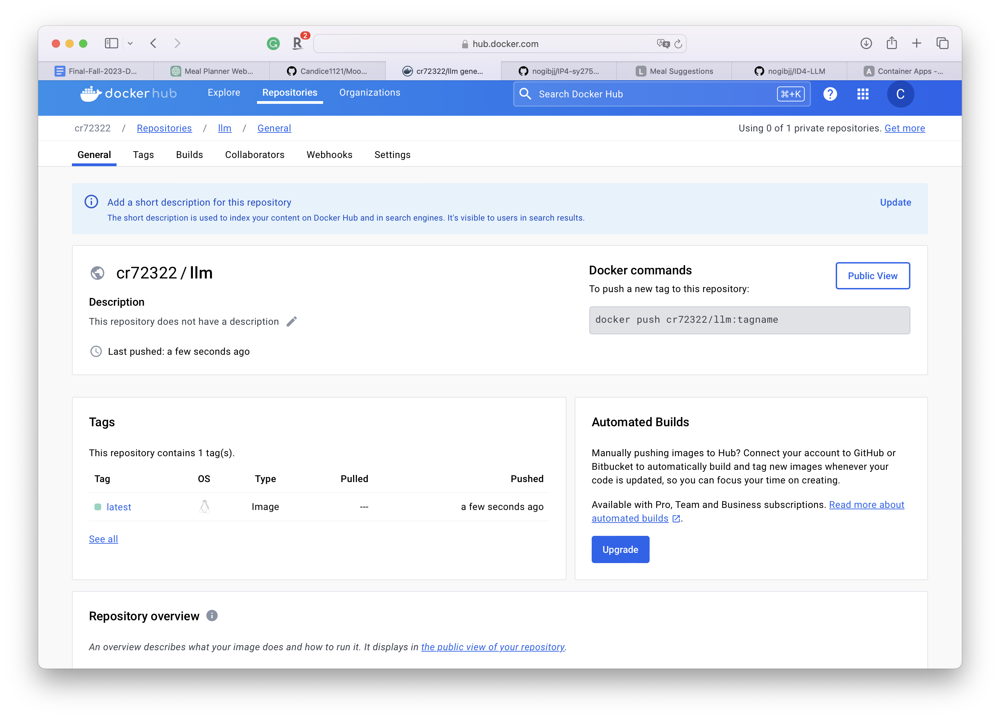
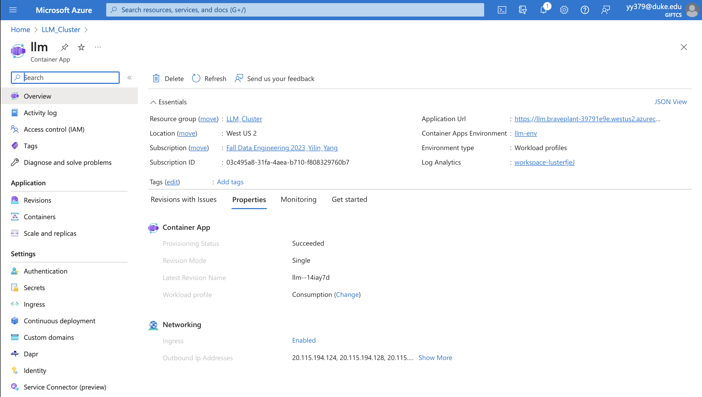

# IDS 706 Data Engineering Individual Project 4

Yilin Yang 

## Website & Video explanation
[Meal Planner](https://706id4.azurewebsites.net)


[Youtube Link]()

## Purpose of the project

The purpose of this individual project is to build a web application using Flask. We call the API for a Large Language Model (LLM) within the web app to implement our functionality.


## Overview

This project allows input of a piece of text describing the food and cusine style to generate a web page of meal suggestions.

## Flask

A flask app is developed to handle requests from the user. The app is in `app.py`. It can be run locally using the following command:

```bash
flask run
```

There are two interfaces in the app: 

1. The user inputs the food description and cusine style in the index page.


2. The use get the suggestions in the result page.


## LLM Integration

In this project, the API of OpenAI is integrated with the app. A token was generated for the app to use.


## Containerization

To make the project easy to deploy, it is containerized with docker.

First, log in to Docker Hub in the terminal using the following command.

`docker login --username <username>`


Then the files in the project directory are packed into a docker image using the following command:

`docker build -t <username>/<repo name> .`


Then the image is pushed to Docker Hub using the following command:

`docker push <username>/<repo name>`

Here is the command line view of the process.


It can be verified that the image is successfully uploaded by checking the repository.

Here is what this project's repository looks like after the push.



## Deployment

The website is then deployed to Azure. Add the LLM API key, and the website port `WEBSITES_PORT` to the configuration.

Here is a screenshot of the Azure page.



## Reference
https://github.com/DerekLW6/Azure-Flask-App


